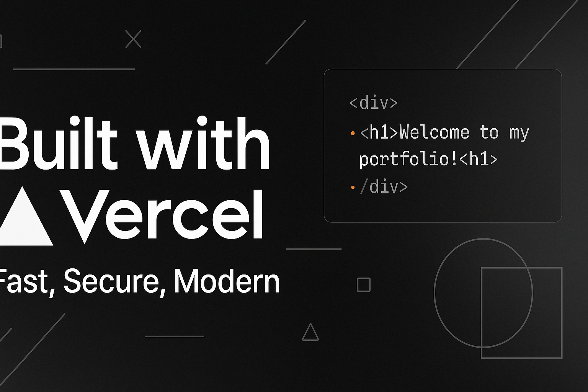

  

# 🌐 Portfolio Maker – Développé avec Vercel

Bienvenue sur le dépôt de mon **portfolio professionnel**, une vitrine de mes projets, compétences et services dans le domaine du développement web, du design UI/UX, et de la création digitale.

---

## 🚀 Aperçu
Ce portfolio a été conçu pour refléter mon identité visuelle tout en assurant performance, accessibilité et fluidité. Il a été **développé en front-end moderne** (Next.js / React) et **déployé sur la plateforme Vercel** pour une mise en ligne simple et ultra-rapide.

🌍 Voir le site en ligne : [https://PORTFOLIO.app](https://isaac-elbaze-portfolio.vercel.app/)

---

## 🛠️ Technologies utilisées

- **Next.js** – Framework React optimisé pour le SSR et la performance
- **React.js** – Interface dynamique et composants réutilisables
- **Tailwind CSS** – Style rapide, responsive et moderne
- **Framer Motion** – Animations douces et interactives
- **Vercel** – Déploiement continu et hébergement ultra-rapide

---

## 📦 Déploiement avec Vercel

Vercel m'a permis de :
- Pusher simplement le projet via GitHub
- Déployer automatiquement chaque `commit` sur une URL de preview
- Obtenir un **domaine personnalisé** en quelques clics
- Bénéficier d’un **hébergement gratuit, sécurisé et scalable**

### ➕ Avantages
✅ Aucun besoin de config serveur  
✅ CI/CD intégré  
✅ Pages statiques et dynamiques optimisées automatiquement  

---

## 📂 Structure du projet (simplifiée)
\`\`\`bash
/
├── public/             # Images et ressources statiques
├── components/         # Composants React réutilisables
├── pages/              # Pages du site (Next.js routing)
├── styles/             # Fichiers CSS (ou Tailwind config)
└── vercel.json         # Config spécifique si besoin
